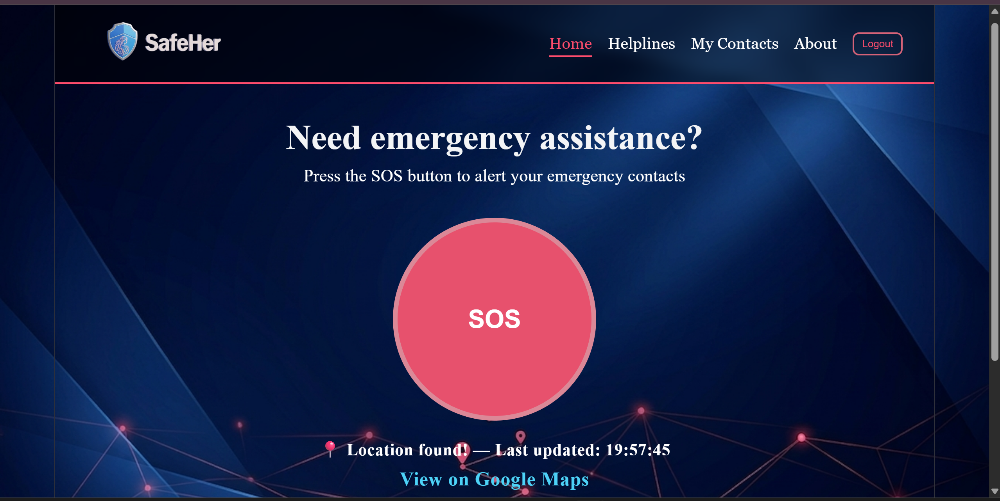
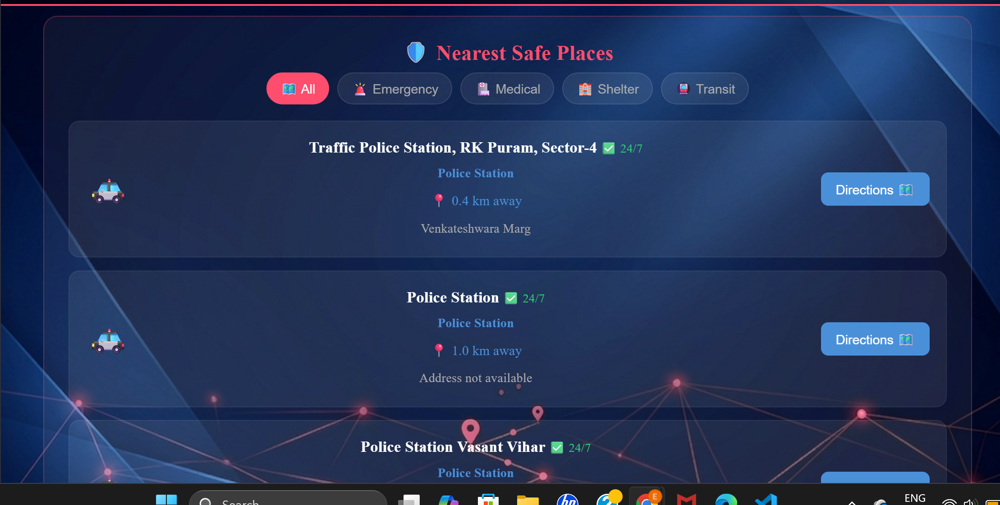
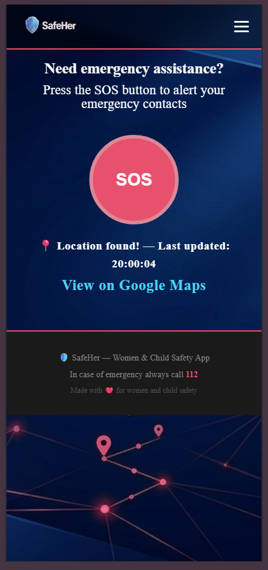

# 🛡️ Safeher- Women & Child Safety App
A full-stack emergency safety web application built for women and children. Press the SOS button to instantly alert emergency via SMS with your live GPS location , and find the nearest safe places around you.
**Live Demo:** [https://safeher-react.vercel.app](https://safeher-react.vercel.app)

## SCREENSHOTS




## FEATURES
- **SOS Alert** — One-click emergency button with 5-second countdown and cancel option
- **Live GPS Location** — Fetches real-time coordinates and generates Google Maps link
- **Real SMS Alerts** — Sends emergency SMS to all saved contacts via Twilio
- **Nearest Safe Places** — Shows nearby police stations, hospitals, pharmacies and more using Overpass API
- **Firebase Authentication** — Secure login and registration system
- **Emergency Contacts** — Add up to 5 emergency contacts stored in Firebase Firestore
- **Night Mode Detection** — Warns about places that may be closed after hours
- **PWA Support** — Works offline, installable on mobile like a native app
- **Mobile Responsive** — Hamburger menu and responsive design for all screen sizes
- **Toast Notifications** — Clean, auto-dismissing notifications instead of browser alerts

## TECH STACK
### Frontend
| Technology | Purpose |
|---|---|
| React + Vite | Frontend framework |
| React Router | Page navigation |
| Firebase Auth | User authentication |
| CSS3 | Styling and animations |
| PWA (vite-plugin-pwa) | Offline support |

### Backend
| Technology | Purpose |
|---|---|
| Node.js | Runtime environment |
| Express.js | Backend framework |
| Firebase Firestore | Database |
| Twilio SMS API | SMS alerts |
| Overpass API | Nearby safe places |

### Deployment
| Service | Purpose |
|---|---|
| Vercel | Frontend hosting |
| Render | Backend hosting |
| Firebase | Auth + Database |

---
## HOW TO RUN LOCALLY
### Prerequisites
- Node.js installed
- Firebase project set up
- Twilio account

### Frontend Setup
```bash
git clone https://github.com/YOUR_USERNAME/safeher-react.git
cd safeher-react
npm install
npm run dev
```

### Backend Setup
```bash
git clone https://github.com/YOUR_USERNAME/safeher-backend.git
cd safeher-backend
npm install
node server.js
```

### Environment Variables
Create a `.env` file in the backend folder:
```
TWILIO_ACCOUNT_SID=your_twilio_sid
TWILIO_AUTH_TOKEN=your_twilio_token
TWILIO_PHONE_NUMBER=your_twilio_number
PORT=5000
```

---

## KEY TECHNICAL DECISIONS

**Why Overpass API instead of Google Places?**
Overpass API is completely free with no API key required, making it perfect for a safety app that needs to be accessible to everyone.

**Why Firebase instead of a custom database?**
Firebase provides real-time updates, built-in authentication, and free tier hosting — ideal for a safety app where reliability is critical.

**Why PWA?**
Emergencies can happen anywhere — including areas with poor internet. PWA caching ensures the app loads even offline, and GPS works without internet via satellite.

---

## EMERGENCY HELPLINES

| Helpline | Number |
|---|---|
| National Emergency | 112 |
| Police | 100 |
| Ambulance | 102 |
| Women Helpline | 1091 |
| Child Helpline | 1098 |

---

## FUTURE IMPROVEMENTS

- [ ] Per-user contacts (currently shared across all users)
- [ ] WhatsApp alerts in addition to SMS
- [ ] Voice SOS activation
- [ ] Real-time location sharing with contacts
- [ ] DLT registration for production SMS delivery

---

## DEVELOPER

**Eva Arya**
- GitHub: [@aryaeva16-svg](https://github.com/aryaeva16-svg)
- Live App: [safeher-react.vercel.app](https://safeher-react.vercel.app)

---

## LICENSE

This project is open source and available under the [MIT License](LICENSE).

---

*Made with ❤️ for women and child safety*`